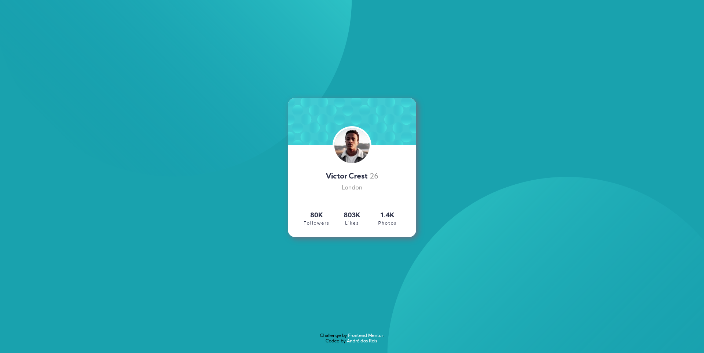

# Frontend Mentor - Social proof section solution

This is a solution to the [Profile card component challenge on Frontend Mentor](https://www.frontendmentor.io/challenges/profile-card-component-cfArpWshJ). Frontend Mentor challenges help you improve your coding skills by building realistic projects. 

## Table of contents

- [Overview](#overview)
  - [The challenge](#the-challenge)
  - [Screenshot](#screenshot)
  - [Links](#links)
- [My process](#my-process)
  - [Built with](#built-with)
  - [What I learned](#what-i-learned)
  - [Useful resources](#useful-resources)
- [Author](#author)
- [Acknowledgments](#acknowledgments)

## Overview

### The challenge

Users should be able to:

- View the optimal layout depending on their device's screen size
- See hover states for interactive elements

### Screenshot



### Links

- [Solution URL](https://github.com/andrebdosreis/FEM-NEW-profile-card-component-main)
- [Live Site URL](https://andrebdosreis.github.io/FEM-NEW-profile-card-component-main)

## My process

### Built with

- Semantic HTML5 markup
- CSS custom properties
- Flexbox
- Mobile-first workflow


### What I learned

This challenge was important to learn some different codes I can use in css-background. For example, i didn't know I can use 2 or more background images in the same component (body, in this case):

To see how you can add code snippets, see below:

```css
background: url(images/bg-pattern-top.svg), url(images/bg-pattern-bottom.svg);
    background-repeat: no-repeat, no-repeat;
    background-position: right 50vw bottom 50vh, left 55vw top 50vh;
    background-color: var(--pri-dark-cyan);
}
```
### Useful resources

- [B7 Web](https://www.b7web.com.br) - B7Web is an online web developer course from Brazil. So i learned how to write HTML and CSS codes studying B7Web's classes.


## Author

- Website - [André dos Reis](https://www.andredosreis.com.br)
- Frontend Mentor - [@andrebdosreis](https://www.frontendmentor.io/profile/andrebdosreis)
- Twitter - [@andrebdosreis](https://www.twitter.com/andrebdosreis)


## Acknowledgments

Thanks FrontEndMentor.io for challenge. I'm learning a lot with you.
